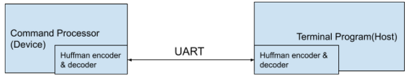
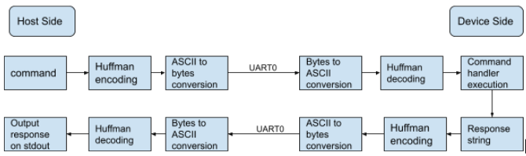
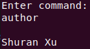
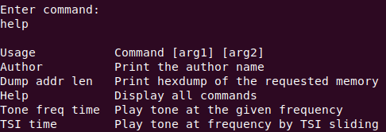
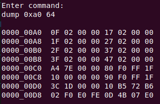
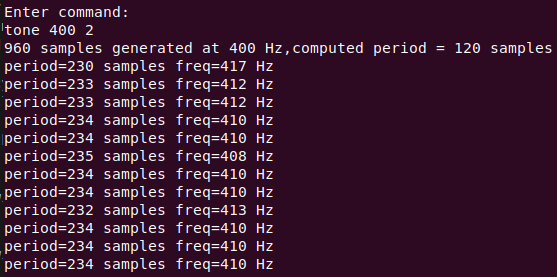
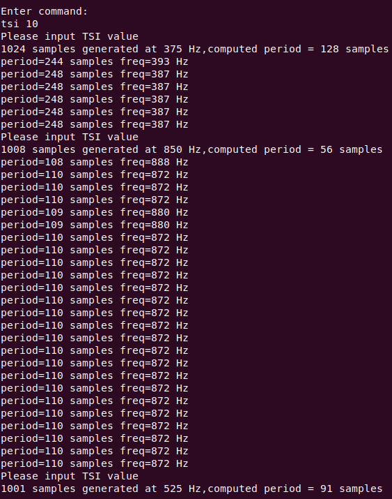
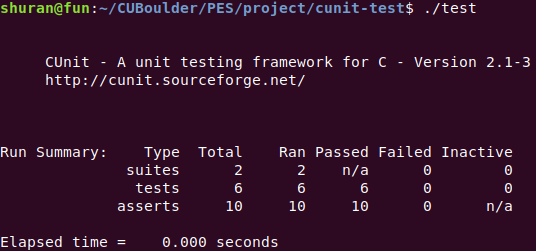
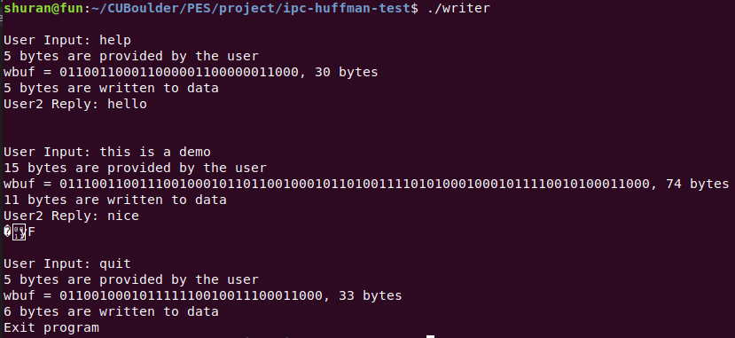
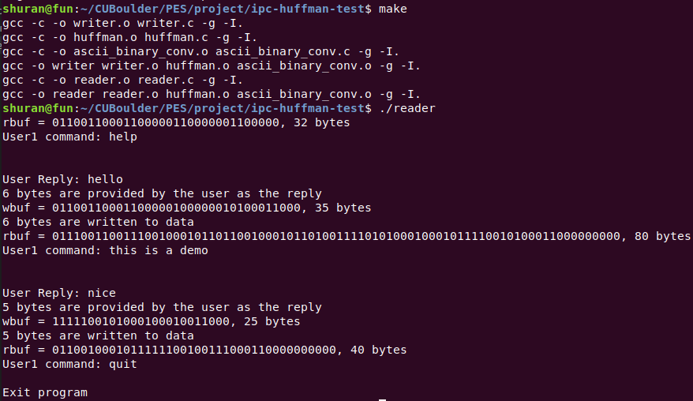

# PES-Final-Project

## Introduction

This repository delivers the final project to the PES course. Overall, the project establishes a UART-based communication system where the host application interacts with the command processor running on the FRDM-KL25Z. To be more specific, the host application sends commands to the command processor and the processor responds accordingly and delivers outputs to the host program if necessary. In particular, all messages transmitted between the two parties are compressed using the [Huffman coding algorithm](https://www.techiedelight.com/huffman-coding/) for throughput optimization. The high-level system block diagram can be shown as follows:



The data transmission process can be illustrated from the following data flow diagram:



The detailed description of the transmission process will be discussed in later sections.

## User Guide

Prior to running any program, please ensure only one FRDM-KL25Z is connected to the host via USB. The deployment of the binay for FRDM-KL25Z can be done via MCUXpresso. And the host application `terminal` can be built by running the `Makefile` located under `host/` directory. Upon launching the host application `terminal` and booting the FRDM-KL25Z, users are free to start sending commands to the device. The serial port representing the connected FRDM-KL25Z is automatically detected and configured to be compatible with the device when `terminal` is up running. The current `UART0` is configured as follows:

| Baud Rate  | Stop Bits | Parity Bit | Data Bits |
| ------------- | ------------- | ------------- | ------------- |
| 115200  | 2  | 0 | 8 |

In terms of the available commands, the commmand processor currently supports the following commands:

| Commands Description | Command | Argument Description |
| ------------- | ------------- | ------------- |
| Print the author name | `Author` | `N/A` |
| Print hexdump of the requested memory | `Dump address length` | `Address`: source memory address; `length`: data length to be dumped, it has to be in decimal or hexdecimal format and should not be larger than 128 and less than 0. |
| Display all commands | `Help` | `N/A` |
| Play tone at the given frequency | `Tone freq time` | `freq`: the target frequency to be played; `time`: the number of seconds to play |
| Play tone at frequency by TSI sliding | `TSI time` | `time`: the number of seconds to play |

The user simply needs to follow the command format and input the command string to the `terminal` program. The following screenshots illustrate the usage for each command:

- `Author`: </br>


- `Help` : </br>


- `Dump` : </br>


- `Tone` : </br>


- `TSI` : </br>


__Note: please watch the message `Please input TSI value`, users are not supposed to touch the TSI when the this command is about to run. Instead, users should only touch the TSI upon the input message is shown. Additionally, users are not supposed to keep touching the TSI while the tone is being played. Users are allowed to touch the TSI again once the input message shows up again.__

## Implementation Details

In this section, the implementation for the huffman coding, ASCII code to raw bytes conversion, serial programming, and the TSI command will be mentioned. Since the remaining commands were covered in the previous assignments, they will not be discussed here.

- Huffman Coding 

Instead of constructing the huffman tree at the runtime, which is the typical implementation method for desktop application, a table containing the huffman code is constructed at the compile time and included on both parities. To be more specific, the table entry is of type `huffman_code_t`, which is defined as follows:

```
typedef struct {
    char c;
    const char *code;
    uint16_t bits;
}huffman_code_t;
```
As can be seen from above, the ASCII code, which is the huffman code in this case, and the number of bits used are provided as attributes for each chartacter. `/var/log/syslog` in Linux host is used as the input file for huffman code generation. With sufficient knowledge of the huffman coding information for each character shown in `/var/log/syslog`, table lookup becomes feasible and the associated implementation is straightforward. 

Two APIs were designed for huffman module:
```
int encode_message(const char *s, char *buf, int buf_size);

void decode_message(const char *s, char *buf);
```

They are for encoding and decoding and the functions are quite self-explanatory. `s` represents the message and `buf` represents the array to store the processed char array.

To correctly detect the end of the tranmssion for each message, special characters are used as the EOF for the sender and the receiver. For the host, the huffman code representing `?` character is appended to the bitstream to be transmitted; for the device, the huffman code representing `.` character is appended to the bitstream to be transmitted. 

- Huffman Code (i.e. ASCII Code) - Raw Bytes Conversion

The essence of the conversion is to represent each bit in the huffman code as one char value stored in a char array. For bit streams which are not multiple of 8, bit 0 will be appended at the least significant bit position. For example, bitstream `110001` will be appended to be `11000100` which represents byte `0x84`. 

APIs are defined as follows intuitively:
```
void ascii_to_byte(char *buf, int bufsize, uint8_t *byte);

void byte_to_ascii(char *buf, uint8_t byte);

int ascii_to_bytes(const char *ascii_str, int ascii_str_size, \
uint8_t *bytes, int bytes_size);

int bytes_to_ascii(char *ascii_str, int ascii_str_size, \
uint8_t *bytes, int bytes_size);
```


- TSI command 

The TSI polling is used in conjuction with the ADC as well as DMA. Specifically, the TSI is polled first to read the current slider length that the user has just reached. Upon the conversion of the length to the tone frequency, the DMA0 is configured for DMA transactions. TPM0 triggers the transactions whenever it is timed out and the ADC0 samples the data and reports the estimated tone frequency. 

## Test Plan

As for testing, many approaches are used to ensure the correctness of each module. 

- CUnit 

CUnit test framework is used to test the APIs for the huffman module and the ASCII-Byte conversion module. Two test suites are created for each module and one representative test case are written for each of the API involved. Besides, `Makefile` is also written to automate the build process. Here is the screenshot showing the CUnit test result:



- IPC program pairs

To test the behaviour of the mix of the huffman coding module and the ASCII-Byte conversion module, a pair of C programs are written in which they talk to each other via `fifo`, which is one of the classical IPC mechanism. The data in between the pairs are preprocessed by the huffman coding and the ASCII-Byte conversion. Specifcially, the `writer` program accepts an user input and transmits the encoded input in raw bytes to the `reader` program, which converts the inputs to ASCII character array, decodes them and prints the postprocessed data to stdout. 
Here are the screenshots to illustrate the communication process:

| Writer             |  Reader |
|-------------------------|-------------------------|
|   |  |

As can be seen above, the user inputs from the writter side are transferred to the reader side, and vice versa. Besides, when the user types `quit` , both programs will gracefully terminate.

_Note: `Makefile` is written to automate the build process._

- cbfifo

The given cbfifo test is included as part of the program and ran at the device boots up. 